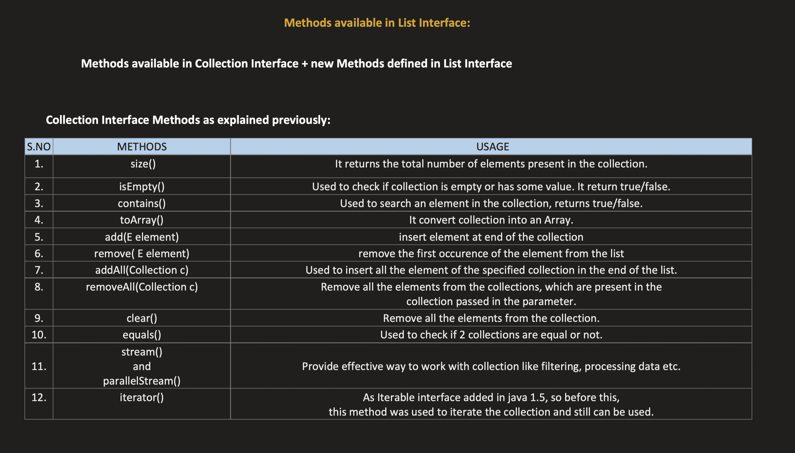
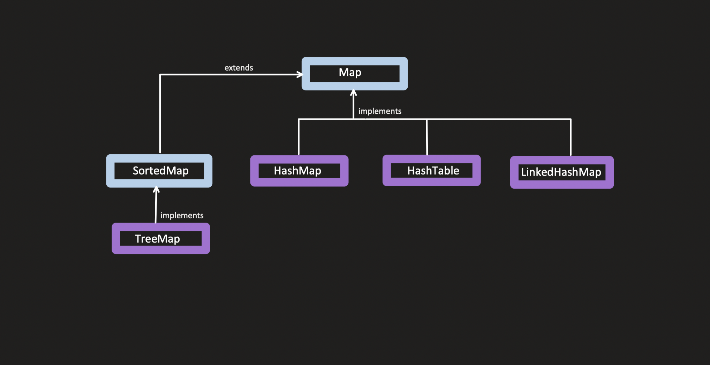

# Collections Frameworks and Streams

### Index:

- [History and Need](#history-and-need)
- [Hierarchy](#hierarchy)
- [Collection Interface](#collection-interface)
    - [List Interface](#list-interface)
        - [ArrayList](#arraylist)
        - [Vector](#vector)
        - [Stack](#stack)
        - [LinkedList](#linkedlist)
    - [Queue](#queue)
        - [Priority Queue](#priority-queue)
        - [deque](#deque)
    - [Set Interface](#set-interface)
- [Comparator vs Comparable](#comparator-vs-comparable)
- [Map Interface](#map-interface)
    - [Internal Working of HashMap](#internal-working-of-hashmap)
    - [HashMap](#hashmap)
    - [HashTable](#hashtable)
    - [LinkedHashMap](#linkedhashmap)
    - [TreeMap](#treemap)
- [Stream](#stream)


<br>

- [Important](#important)
- [References](#references)


## History and Need:

Before the Collection Framework(or before JDK 1.2) was introduced, the standard methods for grouping Java objects (or collections) were Arrays or Vectors, or Hashtables. All of these collections had `no common interface`. Therefore, though the main aim of all the collections is the same, the implementation of all these collections was <u>defined independently</u> and had no correlation among them. 


```Java
public static void main(String[] args)
{
    int arr[] = new int[] { 1, 2, 3, 4 };
    Vector<Integer> v = new Vector();
    Hashtable<Integer, String> h = new Hashtable();

    // Adding Elements in Vector and Hashtable
    v.addElement(1);
    v.addElement(2);
    h.put(1, "geeks");
    h.put(2, "4geeks");

    // Accessing the first element of the array, vector and hashtable
    System.out.println(arr[0]);
    System.out.println(v.elementAt(0));
    System.out.println(h.get(1));
}
```

As we can observe, none of these collections(Array, Vector, or Hashtable) implement a standard member access interface, it was very difficult for programmers to write algorithms that can work for all kinds of Collections. 

Another drawback is that most of the ‘Vector’ methods are final, meaning we cannot extend the ’Vector’ class to implement a similar kind of Collection. 

Therefore, Java developers decided to come up with a common interface to deal with the above-mentioned problems and introduced the Collection Framework in JDK 1.2 post which both, legacy Vectors and Hashtables were modified to conform to the Collection Framework.

**Advantages of Collection Framework:**

1. Consistent API:
2. Reduces Programming Efforts:
3. Increased Program speed and qaulity:

## Hierarchy:

Iterable is the root interface.

Collection Interface:

<image src="./images/Collection_Interface.png" width="750" height="400"> <br>

Map Interface:

<image src="./images/Map_Interface.png" width="700" height="400"> <br>


[Collection Interface](#collection-interface) and [Map interface](#map-interface) are different and both extend the Iterable interface.

## Collection Interface:

**Collection:** An object that represents a group of objects, known as its elements.

**Collection Framework:** It provides a set of interfaces and classes that help in managing group of objects.
- In Java, the `Collection interface` (java.util.Collection) and `Map interface` (java.util.Map) are the two main “root” interfaces. Both of them extend Iterable interface.
- The utility package, (`java.util`) contains all the classes and interfaces that are required by the collection framework.

- The utility package, (java.util) contains all the classes and interfaces that are required by the collection framework. 
- The collection framework extends an interface named `Iterable interface` which provides the iterator to iterate through all the collections. 
- This interface is extended by the main `Collection interface` which acts `as a root` for the collection framework.

**Iterable Interface** is the root interface. Any class which implements this interface use `for-each` loop on the objects of that class. [Code](./Programs/IterablePkg/IterableInterface.java)
- Iterable Interface was added in Java 1.5

Methods present in Iterable Interface: **`iterator() and forEach()`**

**Collection Interface** is acts as the root inteface for all the other collection types.
- List, Set, Queue, Deque are some of the interfaces which implement the collection interface. These nterfaces are then used to imlement different classes.

All the methods which are present in the collection interface are shown in the examples of each concrete classes which implement the interface (Inside Programs Directory)

Methods available in Collection Interface:



**Collection vs Collections:**
- Collection is part of Java Collection Framework. Its an Interface.
- Collections is a `utility class` and provide static methods, which are used to operate on collections like swapping, searching, reverse, copy, etc.

```Java
import java.util.Collections;

List<Integer> ls = Arrays.asList(9,8,7,6,5,4,3,2,1);
System.out.println(Collections.max(ls));
Collections.sort(ls);
System.out.println(ls);
```

<hr>

## List Interface:

It is used to store the `ordered collections` of elements. So in a Java List, you can organize and manage data <u>sequentially</u>. It can contain Duplicate elements.

`Note:` In Java, you cannot use primitive types like int, double, or char directly in generic types like List<int> because `generics only support reference types` (objects), not primitive types.

```Java
List<int> ls1 = new ArrayList<>(); // Error
List<Integer> ls2 = new ArrayList<>(); // No errors
```

In List, insertion and removal of elements can be done at any index/position.

The <span style="color: rgb(206, 8, 8)">implementation classes</span> of List interface:
- [ArrayList](#arraylist) | [Vector](#vector) | [Stack](#stack) | [LinkedList](#linkedlist)

`Internal Implementation:` Internally, the implementation of List uses `Array of objects`. If the size is full and we try to add an element then the length of internal array is increased. This behaviour defers from class to class. For example, the length of internal array (Also known as the capacity of the class) is increased by 50% in ArrayList class and is doubled in Vector class.

### Size and Capcity:

Difference between **size and capacity**:
- Size: It is the count of elements currently present in the array.
- Capacity: By default the initial capacity is 10. When resizing is done the capacity changes. If while creation we pass the capacity then the initial capacity would become whatever value we pass.

How does **resizing** occur:
- The class (ArrayList, Vector) will create a new Array with new size (1.5x if ArrayList and 2x if Vector) and copy all the elements from the old array to the new array (TC: O(N)).
- When using remove() method, the capacity of the class is not shrinked automatically.
    - Initial capacity of vector is 2 (user defined). If we add 3 element then the size become 3 and capacity is automatically increased to 4 (2x). Now if we remove 2 elements then the size would become 1 but the capacity would still stay as 4.
    - We can achieve shrinking manually.

We don't have direct access to capacity in ArrayList but it is directly accessible in [Vector](./Programs/List/VectorClass.java).

**Notes:**
- ArrayList grows dynamically, usually increasing capacity by 50% when it exceeds its current capacity. Vector grows by doubling its capacity when it exceeds its current limit.
- ArrayList and Vector `can store null` elements.

### ArrayList:

[Code](./Programs/List/ArrayListClass.java)

ArrayList Class implements List Interface which in turn extends Collection Interface.

ArrayList is an `ordered collection`. Which means it will store the elements in same order as passed/created. It can contain duplicate elements.

It can increase the size as per our need.

```Java
// Different Methods of ArrayList Creation

ArrayList<Obj> list0 = new ArrayList<Obj> ();
List<String> list1 = new ArrayList<>();
List<String> list2 = Arrays.asList("Monday", "Tuesday");
String[] list3 = {"Jan", "Feb", "March"};
List<String> list4 = Arrays.asList(strArr);
```

|Operation|Time Complexity|Space Complexity|
|-|-|-|
|Add(Object)|O(1) Element is added at the end<br> Worst Case: O(N) if array is full and need resizing|O(1) <br> O(N) if resizing is needed|
|Add(Index, Object)|O(N) Needs to shift all the elements to right|O(1). No extra space needed except for resizing|
|Remove|O(N) Need to shift all the elements |O(1)|
|Replace|O(1)|O(1)|
|Travers|O(N)|O(1)|


**Methods:**
- All the methods are mentioned in the [code](./Programs/List/ArrayListClass.java).
- remove(). It can either take Object as input or Index as input
- If the list contains Integer objects. `remove(2)` would take 2 as index because 2 is int. `remove((Integer)2)` would take 2 as an element.

There are three things that happen when add() method is used:
- Check Capacity, [Resizing](#size-and-capcity) (If needed), Add the element.

There are three things that happen when remove() method is used:
- Check bounds (If the index is within the valid range), remove the element (and shift all the elements that are in right side of the index by 1 in left direction), reduce the size
- The capacity does not shrink automatically when remove() method is called.


ArrayList is not `Thread Safe`. 
- Thread safe version: 
```Java
List<Integer> list = CopyOnWriteArrayList<>();
```

**Behaviour of removeIf() method:**

```Java
ArrayList<String> ls = Arrays.asList("Monday", "Dummy1", "Tuesday", "Dummy1", "Dummy1", "Wednesday", "Thursday");
ls.removeIf(ele -> ele.equals("Dummy1"));
System.out.println(ls); // [Monday, Tuesday, Wednesday, Thursday]
// We can achieve the same behaviour using stream().
ls = ls.stream().filter(ele -> !ele.equals("Dummy1")).collect(Collectors.toList());
System.out.println(ls); // [Monday, Tuesday, Wednesday, Thursday]
```

<hr>

### Vector

[Code](./Programs/List/VectorClass.java)

Same as ArrayList.

**Difference:** Vector is Synchronized (`Thread Safe`) whereas ArrayList is Not-Synchronized (not thread-safe)

`Stack` is a subclass of Vector.

**Constructors:**
```Java
Vector<E> v1 = new Vector<E>(); // Initial Capacity is 10. Increament is 2x
Vector<E> v2 = new Vector<E>(int n); // Initial Capacity is n. Increament is 2x
Vector<E> v3 = new Vector<E>(int n, int incr); // Initial Capacity is n. Increament is done by adding incr blocks everytime reisizing is needed.
Vector<E> v4 = new Vector<E>(Collection c); // Creates a vector that contains the elements of collection c.
```

<hr>

### Stack

[Code](./Programs/List/StackClass.java)

We can implement Stack using Deque, then why do we need a seperate class for Stack?
- Since its a child of Vector, hence, Thread Safe.

<hr>

### LinkedList

[Code](./Programs/List/LinkedListClass.java)

LinkedList implements `List and Deque`.

|Property|Linked List|Array|
|-|-|-|
|Data Structure|Non-Contiguous|Contiguous|
|Memory Allocation|Typically allocated one by one to individual elements|Typically allocated to the whole array|
|Insertion-Deletion|Efficient|Inefficient|
|Access|Sequential|Random|

**Advantages of Linked List:**
- Dynamic size like Vector.
- Efficient Insertions and Deletions: LinkedList is an efficient data structure for inserting or deleting elements in the middle of the list because you only need to change the links between elements, rather than shifting all elements after the insertion or deletion point.
- LinkedList is faster than ArrayList. Since, in LL we don't need to do shifting.
    - Insert at particular index: O(N) for traversing, O(1) for adding a node.

**Disadvantages of Linked List:**
- Memory overhead: LinkedList requires more memory than ArrayList because each element requires additional memory for the links to its predecessor and successor elements.
- Is Thread Safe? No

## Queue:

FIFO Structure. [Code](./Programs/QueuePkg/QueueInterface.java)

New methods which Queue Interface has
- `add()`: If insertion fails, throw an Exception
- `offer()`: If insertion fails, return false
- `poll()`: Retrieves and Removes head of the queue. Returns Null if Queue is empty.
- `remove()`: Retrieves and Removes head of the queue. Returns Exception (NoSuchElementException) if Queue is empty.
- `peek()`: Retrieve the present at the head of Queue. No removal. Null if queue is empty.
- `element()`: Retrieve the present at the head of Queue. No removal. NoSuchElementException exception if queue is empty.

**Classes which Implement Queue Interface:**

### Priority Queue:

[Min Heap](./Programs/QueuePkg/MinimumPriorityQueue.java) and [Max Heap](./Programs/QueuePkg/MaximumPriorityQueue.java)

[Comparator](#comparator-vs-comparable)

### Deque:

Double Ended Queue. [Code](./Programs/QueuePkg/DequeClass.java)

`ArrayDeque is a concrete class`, implements the methods which are available in Queue and Deque class.

ArrayDeque and PriorityQueue are `not thread safe`.

**Thread Safe Versions:** PriorityBlockingQueue and ConcurrentLinkedDeque

`Note:` HashSet internally uses HashMap, LinkedHashSet internally uses LinkedHashMap, TreeSet internally uses TreeMap.

## Comparator vs Comparable:

Comparator and Comparable both help in sorting the collection of objects.

- Sorting in Descending order
- [Objects collection sorting](./Programs/Comparators/ObjectsCollectionSorting.java)


**Comparator** is a functional interface with one abstract method named `int compare(T o1, T o2);`
- to compare 2 variables and decide whether to swap or not.

Method returns:
- 1: If o1 > o2
- 0: If o1 == o2
- -1: If o1 < o2

**`Swapping is done` if the value is greater than 0 (>0).**

Comparator can either be used in Lambad function or used while creating the seperate comparator class which then can be used to sort the collection of objects. [Code](./Programs/Comparators/UseOfComparableAndComparator.java)

**Comparable** has the `int compareTo(T obj)` method.

| Feature            | Comparable                | Comparator                      |
| ------------------ | ------------------------- | ------------------------------- |
| **Package**        | `java.lang`               | `java.util`                     |
| **Method**         | `compareTo(T o)`          | `compare(T o1, T o2)`           |
| **Sort Order**     | Natural (default, single) | Multiple custom                 |
| **Implemented by** | `The class itself`        | `Separate class / lambda`       |
| **Flexibility**    | Only one sorting sequence | Many sorting sequences possible |

[Use of Comparator and Comparable](./Programs/Comparators/UseOfComparableAndComparator.java)

**Thumb Rule:**
- Use Comparable when your class has a single natural ordering (like sorting numbers or names alphabetically).
- Use Comparator when you want multiple or external orderings.


## Map Interface:



Why is map not a part of Collection interface?
- All the extending interfaces in Collection like list, set, etc. They all perform on single collection of data.
- Map works on key-value type of data.

### Type of Map:

- **`HashMap`**: Does not maintain the order.
- **`HashTable`**: Synchronized version of HashMap.
- **`LinkedHashMap`**: Maintains the insertion order.
- **`TreeMap`**: Sorts the data internally.

[HashMap](#hashmap) | [HashTable](#hashtable) | [LinkedHashMap](#linkedhashmap) | [TreeMap](#treemap)

**Methods available in Map Interface:**
```
size(), isEmpty(), containsKey(key), containsValue(key), get(key), put(k,v), remove(k), putAll(Map<k,v>), clear(), putIfAbset(k,v), getOrDefault(k, defaultValue)

Set<k> keySet(), Collection<v> values(), Set<Map.entry<k,v>> entrySet().
```

`entrySet()` is a method in Map that returns a Set of all key–value pairs as Map.Entry objects.

### HashMap:

[Code](./Programs/MapInterface/HashMapPkg/HashMapClass.java)

How does put and get methods work? For this we first need to know how is data stored in a Map.

Things we need to know before knowing how data is stored:
1. Load Factor
2. Entry<k, v> interface
3. Re-hashing
4. Performance

There is a sub interface named Entry inside the Map Interface. Map is an `array of Entry<k, v>`.

**How is Data Stored in Map, and how does get and put methods work in Map?**

**HashMap:**

In the HashMap data is stored in an array of Inner `Node` class which internally implements the Map.Entry<k,v> interface.
- Default initial size of this array is 1<<4.
Node class has int hash, K key, V value and Node<k,v> next class variables. 

Method Working:

How does put method work in HashMap?

1. Do hashing on key.
2. Do Modulo by size of the array on that hash.
3. Store the hash,key,value,next at that index of array of Node<k,v>.
    3.1 What is `collision occurs` while getting the index?

**When Collision Occurs:**

In HashMap, when trying to use put, we get a hashcode based on key and is then converted to the index of the array of Nodes. If there already exists an object, then this new object is added in the LinkedList.
- The link is achieved with the use of next class variable of Node.
- These objects in the LL are also called Buckets or Beans.


Note: After Java 8, there has been a change in this list, if the size of the list `goes beyond TREEIFY_THRESHOLD` which has value as 8, it is then `converted into Red-Black` tree to save the time for querying from N to logN.

```Java
// Code from HashMap.class - looping over the list
p.next = newNode(hash, key, value, null);
if (binCount >= TREEIFY_THRESHOLD - 1) // -1 for 1st
    treeifyBin(tab, hash);
```

`Load Factor:`

The average TC of CRUD operations in o(1) and worst TC is O(N). Load factor is used to bring the average TC to constant.

Default load factor of HashMap is 0.75.
- If the size of the array is 17, then based on load factor the value comes as 12. Meaning whenever the 13th Key-Value entry comes, HashMap does re-hashing. It will increase the size (Double it).
- Since, resizing keeps happening when volume increase, chances of collision decrease hence it helps in keeping the average TC constant. 
- But its not guarenteed that only load factor helps in keeping this constant. Even if size of the array is large, but in worst case for each key, the value of index from hash code comes as same.
    - Treeify threshold comes here. 

`Treeify Threshold:`

The moment the size of linked list goes beyong treeify threshold, convert the list into balanced binary search tree (red-black tree).
- Because of the balanced BST, the worst TC comes down to O(logN)

Working of Get:
- Get the hash code from Key
- Get the index from that hash code
- Traverse in the list pressent at that index and if found return the value for that key

Hash of same key should be same in both put and get operations.

There are two Contracts between `hashcode and equal` method.
1. If obj1 == obj2, then theie hash **must also be same**
2. If two objects have same hash, it **doesn't mean** these two objects are equal
    - Hash is used for getting to a particular index. If there are 2 objects with same hashcode, we go to same index for those objects. But we don't really care if index is coming same for different objects as we are tackeling the collision.

### HashTable:

HashMap is `Not Thread Safe`. HashTable is the thread safe version of HashMap.

Unlike HashMap, HashTable does not contain null key or null values.

ConcurrentHashMap can also be used for Synchronised (Thread safe) access.

### LinkedHashMap:

[Code](./Programs/MapInterface/LinkedHashMapPkg/LinkedHashMapClass.java)

Similar to HashMap. Major difference is that `LinkedHashMap maintains the order`.

2 types of order it maintains:
- Insertion order
- Or maintain the access order

Access order? One which is most recently used. Least recently used items on left and `most recently used items on the right` in order from left to right.

Its similar to HashMap, but it used `Double LinkedList`.

LinkedHashMap Entry (Node) has these `properties`: hash, value, next, before, after. (Before and After are used for Double Linked List to track the order of insertion. Next is used for pointing to next node at the same index in array when collision occurs)

```Java
// forEach() of LinkedHashMap

// start iterating from head and go to node pointing using after (instead of next)
for (LinkedHashMap.Entry<K,V> e = head; e != null; e = e.after)
    action.accept(e.key);
```

There are `afterNodeAccess`, `afterNodeInsertion`, `afterNodeRemoval` methods present inside the LinkedHashMap class which help in access based reordering.

There is `no thread-safe version available` for LinkedHashMap, we have to manually make it thread-safe using synchronisedMap method of Collections class.

### TreeMap

TreeMap implements NavigableMap extends SortedMap extends SequencedMap extends Map.

Is sorted according to ites natural ordering of its Key or by Comparator provided during Map creation. Uses Red-Black tree.

[Code](./Programs/MapInterface/TreeMapPkg/TreeMapClass.java)

O(logN) TC for insert, remove, get operations

`Entry (Node) contains` these things: key, value, left, right, parent, color.

`Additional Methods` present in the sorted map: headMap(), tailMap(), firstKey(), lastKey().

There are several methods available in NavigableMap which we can use in TreeMap as well.

## Set Interface:

LinkedHashSet maintains the insertion order. TreeSet stores elements in sorted order.

### HashSet:

[Code](./Programs/SetPkg/HashSetClass.java)

Internally it is using HashMap. 
- Is thread safe? No
- Null element allowed? One

hashSet.add(1) internally works like hashMap.put(1, new Object());

Methods present: size(), isEmpty(), contains(), toArray(), add(), remove(), clear(), equals(), stream(), parallelStream(), iterator()

Additional Methods: addAll() -> Union of 2 Sets, removeAll() -> Difference of 2 Sets, retainAll() -> Intersact of 2 Sets

Thread Safe version: CouncurrentHashMap

### LinkedHashSet:

Uses LinkedHashMap.

Inside LinkedHashMap, it maintains insertion order as well as access order. For LinkedHashSet only insertion order is maintained.

Why not access order? Inside the constructor of LinkedHashMap, even if we pass a boolean value for accessOrder, the internal calling of super constructor is done with accessOrder having a value of false.
- The exposure is not provided


### TreeSet:

O(logN) - Uses Red-Black tree.

No null elements are allowed.


## Stream

[Code](./Programs/StreamPkg/StreamClass.java)

We can consider stream as `a pipeline, which our collection elements pass through`.

While elements pass through pipelines, it performs various operations like sorting, filtering, etc.

Useful when dealing with **`bulk processing`**. (It can also do parallel processing)

Steps to perform:
- Step-1: Create stream on Collection
- Step-2: Intermediate Operations: filtered(), sorted(), map(), distict(), etc.
    - These operations transforms the stream into another stream and more operations can be done on top of it.
    - These are `lazy in nature`, meaning these operations get executed only when terminal operation is invoked.
- Step-3: Terminal Operations: collect(), reduce(), count()
    - These operations trigger the processing of stream
    - And produce the output. After terminal operation is used, **no more operations can be performed**.
    - There can only be one terminal operation. It closes the stream. 

When we use streams, original **`data is not changed`** at all.

**Different ways to create the stream:** 
- Mentioned in the code file


**List of intermediate methods that are present in stream:**
- filter(): Used to filter elements based on given condition
- map(): It is used to transform each elements
- flatMap(): Used to flatten nested structures
- distinc(): Removes duplicate from stream
- sorted(): Sort the elements
- peek(): Helps in to see the intermediate result of the stream which is getting processed
- limit(): truncate the stream, to have no longer than the given maxSize
- skip(): skip the first n element of the stream
- mapToInt(): helps to work with primitive int data type.
    - mapToLong(), mapToDouble()

**`Notes:`**
- A Stream `can be consumed only once`. If we perform a terminal operation on a Stream, we cannot use the same stream again.

**Why are intermediate operations called Lazy in nature?**

```Java
List<Integer> ls = Arrays.asList(1,2,3,4,5,6,7,8,9);
Stream<Integer> stream = ls.stream().filter((Integer num) -> num > 2).peek((Integer num) -> System.out.println("Ele: " + num));

// No output.
// Why? peek() is an intermediate operation. We have not used any terminal operation hence filter and peek and not executed.

// If we call a terminal operation, then it would print in output
stream.collect();
```

### Sequence of stream operations:

For each elements in the collection, while doing stream, we go as deep as possible in operations.

There are certain operations which cannot be performed on partial collection. (Like sort())

Two types of intermediate operations: `Stateless` and `Stateful`

Refer to [sequenceOfStreamOperations()](./Programs/StreamPkg/StreamClass.java) method.

**List of intermediate methods that are present in stream:**
- forEach(): Perform an action on each elements of the stream. Does not return any value.
- count(); Count the number of elements in the result of the stream
- toArray(): Collects the element of the stream into an array
- reduce(): Does reduction on the elements of the stream. Perform associative aggregation function.
- min() and max(): min() for getting the first element of the result, max() for getting the last element of the stream result.
- anyMatch(), allMatch(), noneMatch()
- findFirst(), findAny()

**Do We Wait for the Whole Stream Before Terminal Operation?**

Not always. Streams are pulled, not pushed.
- Each element flows on demand from source → intermediate → terminal, one by one, unless a stateful operation interrupts it.


### Parallel Stream:

Helps to perform operations on stream concurrently, taking advantage of multi core CPU.

Internally it does:
- Task splitting: It uses "spliterator" function to split the data into multiple chunks
- Task submission and parallel processing: Uses `fork-join pool technique`


### Stream like behaviour for Map and Set:

[Set](./Programs/StreamPkg/StreamInSet.java) also implements Collection so it directly.

Map does not implement Collection interface. Hence, we cannot directly use stream on map. We can achieve that by converting it into a Collection view.

- map.keySet() → Set<K>
- map.values() → Collection<V>
- map.entrySet() → Set<Map.Entry<K, V>>

[Code](./Programs/StreamPkg/StreamInMap.java)


## Important:

1. Design Hash Map: Interview question.
2. How to handle the case of Collision?

[Thread related issue](./Programs/ThreadRelatedIssuePkg/UpdateWhileReadingIssue.java)

## Reference:

[1] [Java Collection - GFG](https://www.geeksforgeeks.org/collections-in-java-2/) <br>
[2] [Java Collection Crash Course](https://www.youtube.com/watch?v=92k5uokmW9o&t=38s) <br>